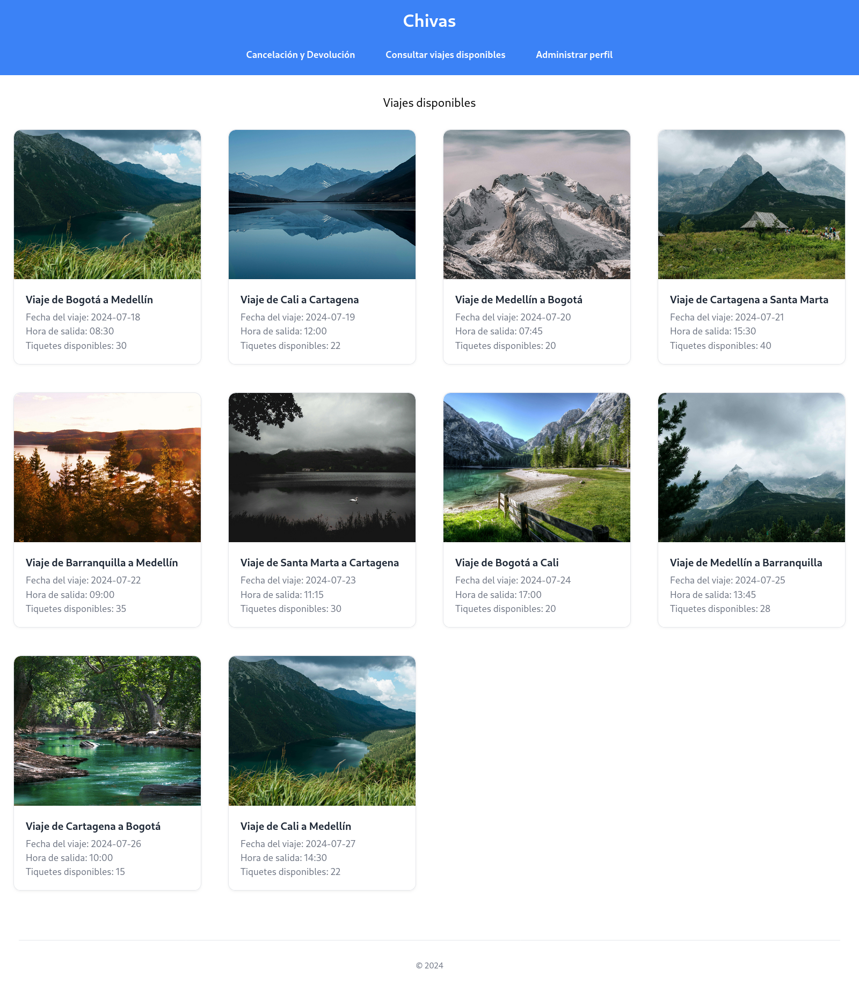
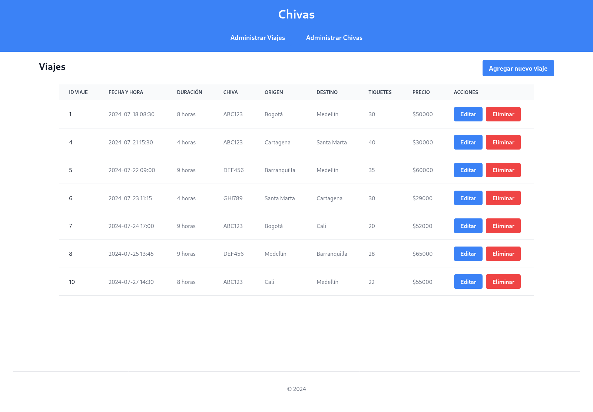
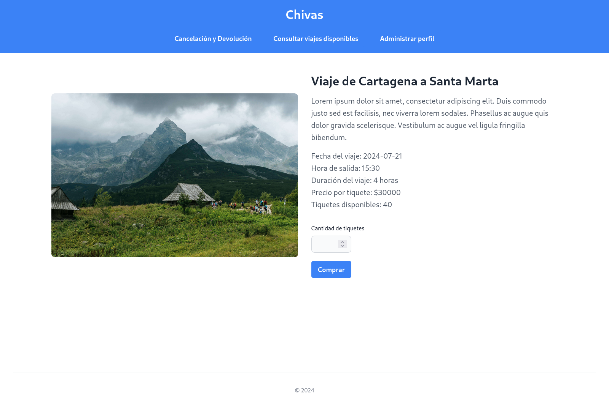

# App Chivas — Sistema de Reservas de Viajes

> *Full-stack ticket booking system for intercity "chivas" (traditional Colombian buses), with role-based access, trip/fleet management, and a complete purchase–cancellation–refund flow.*


Proyecto realizado para la materia de **Ingeniería de Requisitos** de la Universidad Nacional de Colombia. Es una aplicación web que permite administrar y comprar tiquetes de viajes en chivas, con dos perfiles diferenciados: administrador y usuario.

## Vista previa



## Funcionalidades

| Rol | Funcionalidad | Descripción |
|---|---|---|
| Administrador | Administrar viajes | Crear, editar y eliminar viajes (origen, destino, fecha, hora, duración, precio). |
| Administrador | Administrar chivas | Crear, editar y eliminar chivas (matrícula, capacidad, conductor, estado). |
| Usuario | Consultar viajes disponibles | Ver el detalle de cada viaje y comprar tiquetes. |
| Usuario | Cancelación y devolución | Cancelar tiquetes comprados con reembolso automático del valor. |
| Usuario | Administrar perfil | Editar nombre, correo electrónico y contraseña. |

## Construido con

* [Node.js](https://nodejs.org/) — Backend de JavaScript
* [EJS](https://ejs.co/) — Motor de plantillas
* [Tailwind CSS](https://tailwindcss.com/) — Framework de diseño CSS
* [MySQL](https://www.mysql.com/) — Sistema de gestión de bases de datos

## Comenzando

### Prerrequisitos

* [npm](https://www.npmjs.com/) — Gestor de paquetes de Node.js
* [MySQL](https://www.mysql.com/) — Sistema de gestión de bases de datos

### Instalación

1. Clona este repositorio:

   ```bash
   git clone https://github.com/maalvarezmu/app-chivas.git
   ```

2. Crea el archivo `.env` en la raíz del proyecto:

   ```bash
   DB_HOST=el_host_de_tu_servidor_mysql
   DB_USER=tu_usuario
   DB_PASSWORD=tu_contraseña
   DB_PORT=el_puerto_de_tu_servidor_mysql
   DB_DATABASE=tu_base_de_datos
   ```

3. Crea la base de datos ejecutando el script incluido en `database/db.sql`.

4. Instala las dependencias:

   ```bash
   npm install
   ```

5. Construye los estilos de Tailwind CSS:

   ```bash
   npm run build
   ```

6. Levanta el servidor local:

   ```bash
   npm run dev:server
   ```

7. Abre `http://localhost:3000` en tu navegador.

## Más vistas previas


<hr>


## Contribuyendo 

Aprecio cualquier sugerencia para mejorar el contenido de este proyecto. Si deseas contribuir, por favor crea un "issue" en el repositorio o contáctame directamente. Valoraré tus aportes para mejorar este repositorio.

## Licencia 

Los códigos incluidos en este proyecto están bajo la Licencia MIT. Para obtener más información, consulta el archivo [LICENSE](LICENSE) en la raíz del repositorio.

## Créditos a Pexels

Las imágenes utilizadas en este proyecto han sido obtenidas de Pexels.com, un sitio web que ofrece fotos de alta calidad de dominio público sin restricciones de licencia. Aunque no es necesario dar atribución en muchos casos, quiero reconocer y agradecer a la comunidad de Pexels por proporcionar recursos visuales gratuitos.

Para obtener más información sobre la licencia de las imágenes específicas utilizadas en este proyecto, consulta las políticas de licencia en el sitio web de Pexels: [Pexels License](https://www.pexels.com/license/).
